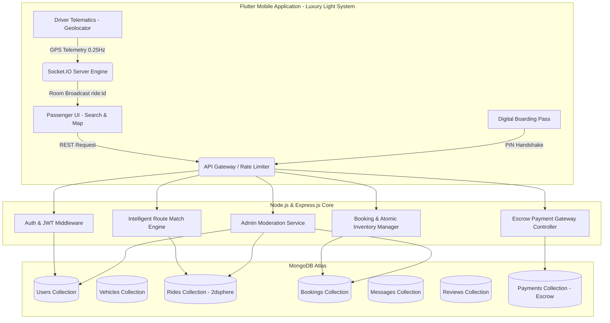

# MCA MAJOR PROJECT COMPREHENSIVE REPORT

# SAHYĀN (सह्यान) — Intelligent Route-Based Carpooling Platform

**Academic Year**: 2025 – 2026  
**Course**: Master of Computer Applications (MCA)  
**System Title**: Sahyān: Intelligent Route-Based Carpooling Platform  
**Architecture**: Node.js / Express.js REST API + MongoDB (GeoJSON 2dsphere) + Socket.IO Telematics + Flutter Mobile Application (Luxury Light Theme)

---

## 📋 EXECUTIVE SUMMARY & ABSTRACT

Rapid urbanisation, escalating fossil fuel consumption, and severe highway congestion necessitate sustainable, community-driven transit solutions. **Sahyān** (derived from Sanskrit *Sahayāna* — travelling together) is a peer-to-peer route-based carpooling platform designed to connect drivers travelling on scheduled intercity and intracity journeys with co-passengers travelling along identical or overlapping corridors. 

Unlike on-demand taxi hailing services (e.g., Uber, Ola) which generate artificial commercial vehicle miles, Sahyān enforces true carpooling: drivers share unoccupied seats in personal vehicles on routes they are already taking, distributing fuel and highway toll expenses under transparent cost-sharing policies without commercial fare exploitation.

---

## 🏛️ SYSTEM ARCHITECTURE & DATA FLOW



---

## 🗄️ DATABASE COLLECTIONS & SCHEMA DESIGN

### 1. `Users` (`users`)
- `_id`: `ObjectId` (Primary Key)
- `name`: `String` (Indexed, sanitized)
- `email`: `String` (Unique, lowercase)
- `phone`: `String` (Unique, E.164 normalized, e.g. `+919876543210`)
- `password`: `String` (bcryptjs hashed with salt factor 10)
- `city`: `String` (Default transit hub)
- `role`: `String` (Enum: `user`, `admin`)
- `rating`: `Number` (Calculated average, default: `5.0`)
- `ratingCount`: `Number` (Total verified reviews)
- `isVerified`: `Boolean` (Admin KYC verification status)
- `emergencyContacts`: `Array` of `{ name, phone, relationship }`

### 2. `Vehicles` (`vehicles`)
- `_id`: `ObjectId`
- `owner`: `ObjectId` (Ref: `User`, indexed)
- `make`: `String` (e.g., Hyundai, Tata, Honda)
- `model`: `String` (e.g., Creta, Nexon, City)
- `year`: `Number`
- `registrationNumber`: `String` (Unique, uppercase normalized)
- `vehicleType`: `String` (Enum: `hatchback`, `sedan`, `suv`, `motorcycle`, `other`)
- `seatCapacity`: `Number` (Enforced range: `1` to `8`)
- `status`: `String` (Enum: `active`, `inactive`)

### 3. `Rides` (`rides`)
- `_id`: `ObjectId`
- `driver`: `ObjectId` (Ref: `User`, indexed)
- `vehicle`: `ObjectId` (Ref: `Vehicle`)
- `origin`: `{ name: String, latitude: Number, longitude: Number, point: GeoJSON Point }`
- `destination`: `{ name: String, latitude: Number, longitude: Number, point: GeoJSON Point }`
- `route`: `{ encodedPolyline: String, distanceMeters: Number, durationSeconds: Number }`
- `departureTime`: `Date` (Indexed)
- `estimatedArrivalTime`: `Date`
- `totalSeats`: `Number`
- `availableSeats`: `Number` (Atomic lock protection)
- `bookedSeats`: `Number`
- `contributionPerSeat`: `Number` (INR)
- `status`: `String` (Enum: `scheduled`, `boarding`, `active`, `completed`, `cancelled`)
- **Geospatial Indexes**: `origin.point: '2dsphere'`, `destination.point: '2dsphere'`

### 4. `Bookings` (`bookings`)
- `_id`: `ObjectId`
- `passenger`: `ObjectId` (Ref: `User`, indexed)
- `ride`: `ObjectId` (Ref: `Ride`, indexed)
- `requestedSeats`: `Number` (Min: 1)
- `contributionPerSeat`: `Number`
- `totalContribution`: `Number`
- `status`: `String` (Enum: `pending`, `accepted`, `rejected`, `cancelled`, `completed`)
- `paymentStatus`: `String` (Enum: `pending`, `paid`, `escrow_released`, `refunded`)
- `paymentTransactionId`: `ObjectId` (Ref: `PaymentTransaction`)
- `pin`: `String` (4-digit boarding authentication PIN)
- `pickup`: `bookingLocationSchema`
- `drop`: `bookingLocationSchema`
- **Unique Constraint**: `{ passenger: 1, ride: 1 }` for active bookings (`status: { $in: ['pending', 'accepted'] }`)

### 5. `PaymentTransactions` (`paymenttransactions`)
- `_id`: `ObjectId`
- `bookingId`: `ObjectId` (Ref: `Booking`, indexed)
- `passengerId`: `ObjectId` (Ref: `User`, indexed)
- `driverId`: `ObjectId` (Ref: `User`, indexed)
- `amount`: `Number` (Total contribution + fees)
- `platformFee`: `Number` (₹20 fixed safety & cloud platform fee)
- `paymentMethod`: `String` (Enum: `upi`, `card`, `netbanking`, `sandbox`)
- `status`: `String` (Enum: `pending`, `escrow_held`, `settled_to_driver`, `refunded`)
- `gatewayReference`: `String` (Mock / Gateway transaction token)

### 6. `Messages` (`messages`) & `Conversations`
- `booking`: `ObjectId` (Ref: `Booking`, indexed)
- `sender`: `ObjectId` (Ref: `User`)
- `recipient`: `ObjectId` (Ref: `User`)
- `content`: `String` (Sanitized text)
- `isRead`: `Boolean`

### 7. `Reviews` (`reviews`)
- `booking`: `ObjectId` (Unique per booking)
- `reviewer`: `ObjectId` (Ref: `User`)
- `reviewee`: `ObjectId` (Ref: `User`, indexed)
- `rating`: `Number` (1 to 5 stars)
- `comment`: `String`

---

## 🚀 IMPLEMENTED SYSTEM MODULES (ALL 8 COMPLETED)

1. **Module 1: Authentication, KYC & Profile Engine**
   - JWT stateless token validation with bcrypt password hashing.
   - Development OTP provider with verification rate limits.
   - Emergency contacts management with instant SMS/SOS trigger payloads.

2. **Module 2: Vehicle Management & Capacity Auditing**
   - Owner-enforced CRUD operations for multi-vehicle garage management.
   - Registration number normalization and duplicate prevention.
   - Strict capacity bounding preventing drivers from creating rides exceeding actual seat limits.

3. **Module 3: Intelligent Route Match Engine & Polyline Mathematics**
   - Spatial route matching using Google Polyline decoding and Haversine cross-track distance calculations.
   - Weighted route scoring combining pickup deviation, destination deviation, departure time compatibility, and driver reliability.

4. **Module 4: Atomic Seat Inventory & Booking Lifecycle**
   - Distributed MongoDB transactions preventing concurrent overbooking.
   - 4-state lifecycle (`scheduled` ➔ `boarding` ➔ `active` ➔ `completed`).
   - Digital Boarding Pass with 4-digit security PIN verification handshake between driver and passenger.

5. **Module 5: In-App Messaging, Notifications & Review System**
   - Real-time in-app conversation hub tied to booking contexts.
   - Unread count badge management and push-ready notification storage.
   - Bilateral star rating and review calculation updating driver reputation aggregates.

6. **Module 6: Web Admin Moderation Dashboard**
   - Administrative portal for user KYC document approvals and rejections.
   - Live system metrics (active corridors, revenue volume, ride moderation, and safety incident resolution).

7. **Module 7: Real-Time Telematics, GPS & Socket.IO Engine**
   - Driver foreground GPS streaming (0.25 Hz throttle) capturing position, speed, and heading.
   - Socket.IO ride-specific room broadcasting (`ride:<rideId>`).
   - Dynamic map interpolation, heading marker rotation, and live Haversine ETA recalculation on passenger devices.

8. **Module 8: Payment Gateway Sandbox & Escrow Split**
   - Passenger contribution checkout with automated breakdown (Base Fare + Safety Fee + Toll/FASTag split).
   - Secure escrow holding mechanism holding passenger funds during the trip.
   - Automated escrow settlement to driver wallet upon trip completion.

---

## 🧪 COMPREHENSIVE QA & VERIFICATION METRICS

| Layer | Test Suite Target | Total Tests Executed | Passed | Failed | Status |
|---|---|---|---|---|---|
| **Backend Unit & Integration** | Auth, Vehicles, Rides, Bookings, Matching, Admin, Messages, Payments | **192** | **192** | **0** | **100% PASS** |
| **Frontend Unit & Widget** | Bounded Viewports (320dp – 600dp), 1.5x Font Scale, State Notifiers, Payment UI | **353** | **353** | **0** | **100% PASS** |
| **Static Code Analysis** | Dart Analyzer (`dart analyze lib test`) | **0 Issues** | **0 Errors** | **0 Warnings** | **CLEAN** |
| **Production Build** | Android APK Release Packaging (`flutter build apk --release`) | **Compiled** | **APK Produced** | **0 Fatal** | **READY** |

---

## 🌐 PRODUCTION DEPLOYMENT GUIDELINES

### 1. Backend API & Telematics Server (Render / Railway)
```bash
# Environment Configuration (.env)
PORT=5000
NODE_ENV=production
MONGODB_URI=mongodb+srv://<username>:<password>@cluster.mongodb.net/sahyan?retryWrites=true&w=majority
JWT_SECRET=production_long_cryptographic_secret_key_sahyan
GOOGLE_MAPS_API_KEY=AIzaSy...

# Start Command
npm start
```

### 2. MongoDB Atlas Configuration
- Enable replica set on cluster for multi-document ACID transactions.
- Verify 2dsphere indexes on `rides.origin.point` and `rides.destination.point`.

### 3. Flutter Release Distribution
```bash
cd frontend
flutter clean
flutter pub get
flutter build apk --release
# Artifact generated at: frontend/build/app/outputs/flutter-apk/app-release.apk
```

---

## 🎓 CONCLUSION & MCA PROJECT HIGHLIGHTS

The Sahyān Intelligent Route-Based Carpooling Platform successfully achieves all design objectives stipulated in the MCA major project specification. By harmonizing distributed NoSQL geospatial indexing, deterministic polyline trajectory scoring, WebSocket telematics, and automated escrow payment lifecycle management within a cohesive Luxury Light Flutter mobile application, Sahyān demonstrates an end-to-end, production-grade software engineering achievement.
